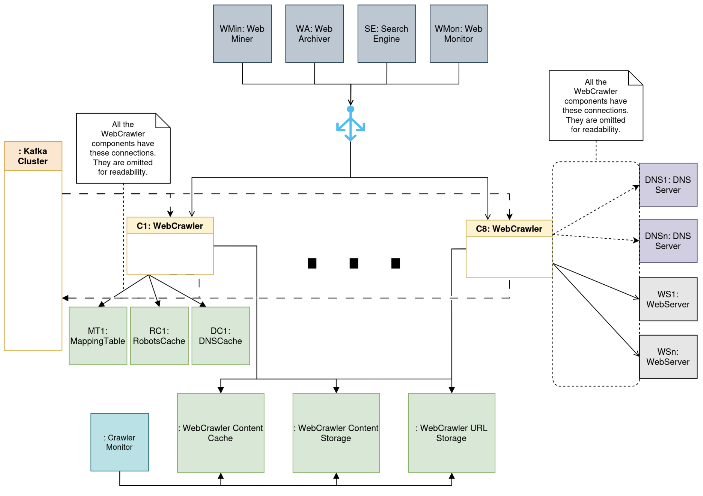
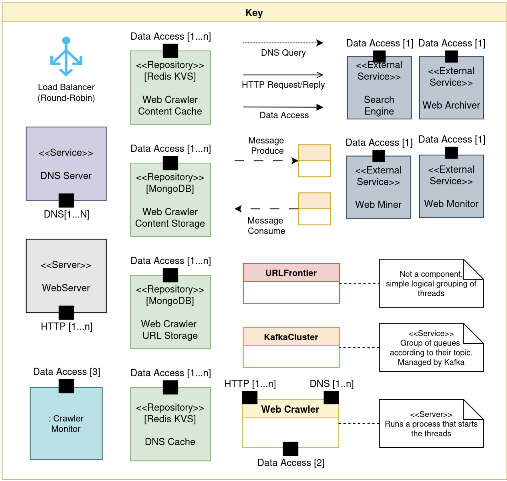
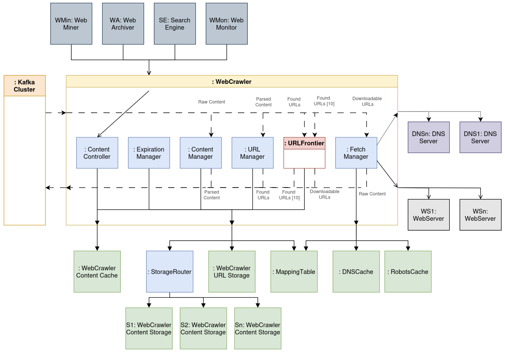
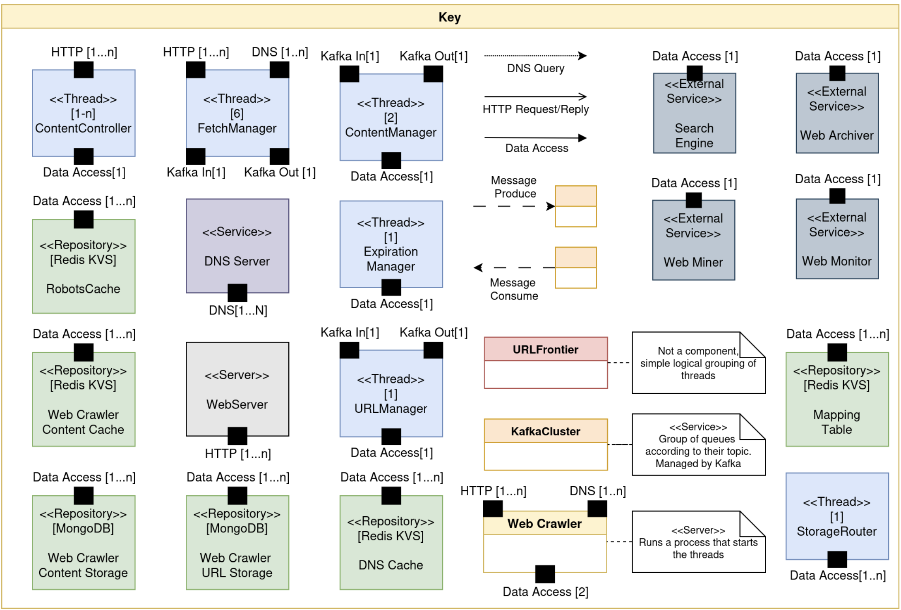
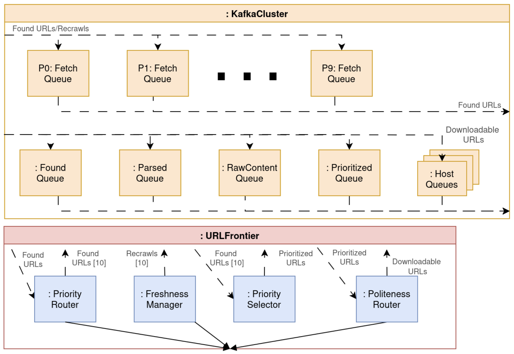
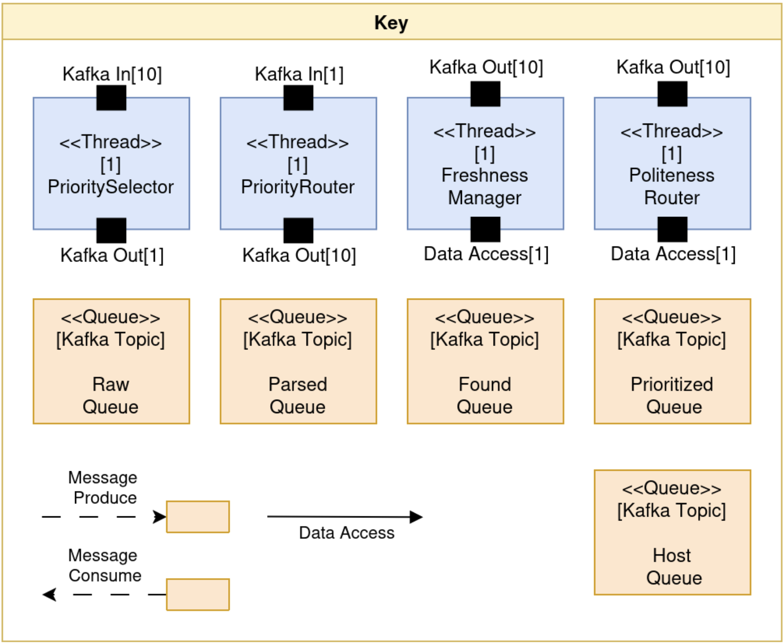

# Designing a Web Crawler: Architecture from Scratch

> **Grade: 20/20** | Software Architecture @ Instituto Superior Tecnico, University of Lisbon | MSc Computer Science 2024/25

A complete architectural design of a **large-scale, distributed web crawler** capable of processing **800+ pages/second** at peak load. Designed using the **Attribute-Driven Design (ADD)** methodology across 8 iterative rounds, addressing performance, scalability, security, availability, and extensibility.

[**Read the full design document (PDF)**](Group%2032%20-%20Web%20Crawler%20Design.pdf)

---

## Quality Attributes at a Glance

| Quality | Scenario | Target |
|---|---|---|
| **Performance** | Normal load throughput | 400 URLs/sec, 95% processed in < 1s |
| **Performance** | Peak load throughput | 800 URLs/sec, 90% processed in < 1s |
| **Performance** | Popular content access | 100ms avg latency |
| **Availability** | Hardware failure recovery | 99.9% uptime, recovery < 2 min |
| **Scalability** | Auto-scaling on demand | New resources in < 5 min, zero downtime |
| **Security** | Spider trap detection | Detected in < 5 min, < 5% throughput loss |
| **Security** | Malicious content resistance | 99.9% attacks detected and blocked |
| **Integrability** | Politeness / robots.txt | Adapts to site rules in < 1s |
| **Modifiability** | New content types (e.g. PDF) | Implemented in < 2 months, zero downtime |
| **Modifiability** | New client integration | < 1 person-month of effort |

---

## Design Rounds

The architecture was developed across **8 ADD rounds**, each tackling specific architectural drivers:

### Round 1 &mdash; Core Functionality
Established the foundational crawling pipeline: seed URL loading, DNS resolution, page fetching, content parsing, link extraction, URL prioritization, and periodic re-crawling. Decomposed the system into **Fetch**, **Content**, **URL**, and **URLScheduler** modules.

### Round 2 &mdash; Performance
Transformed the sequential architecture into a **concurrent, distributed system**:
- Introduced multi-threaded crawling with Kafka-based async communication
- Added DNS caching (Redis) to eliminate redundant lookups
- Built a priority queue system in the URL Frontier for smart scheduling
- Added a content cache (Redis, LFU eviction) for fast reads by external clients
- Scaled to **10 geo-distributed crawler nodes** behind a load balancer

### Round 3 &mdash; Politeness & robots.txt
Designed the politeness enforcement system to ensure respectful crawling:
- One-host-per-thread model via the **Politeness Router** and per-host Kafka topics
- Mapping table to dynamically assign crawler threads to hosts
- robots.txt cache to avoid doubling request latency

### Round 4 &mdash; Scalability
Added runtime adaptability:
- **Crawler Monitor** component that watches repository load and auto-scales nodes
- **Storage Router** with consistent hashing for horizontal content storage sharding

### Round 5 &mdash; Robustness
Handled external faults gracefully:
- Exponential backoff retry (up to 5 attempts) for unresponsive servers
- URL validation to catch malformed URLs before they enter the pipeline

### Round 6 &mdash; Security
Protected against adversarial web content:
- **Spider trap detection** via URL depth/length limits and monitoring
- **JavaScript analysis** (JSAnalyser) to detect and block malicious scripts before rendering

### Round 7 &mdash; Extensibility
Designed for future change with minimal cost:
- Generalized content processing: `ContentValidator` and `LinkExtractor` hierarchies allow plugging in new formats (PDF, images, etc.)
- **Web Monitor** integration path for copyright infringement detection
- **Web Archiver** integration path for long-term historical storage

### Round 8 &mdash; Availability
Ensured 99.9% uptime through redundancy:
- Kafka's built-in fault-tolerant queue replication
- **Active spare replication** (Paxos) for the critical Mapping Table
- **Warm spare** for URL storage
- Cold spare / stateless restart for remaining components

---

## Technology Choices

| Component | Technology | Rationale |
|---|---|---|
| Async messaging | **Apache Kafka** | Fault-tolerant FIFO queues, disk-backed with in-memory batching |
| Content storage | **MongoDB** (sharded) | Document store suited for unstructured web content, horizontal scaling |
| Caching | **Redis** | In-memory KVS for DNS cache, robots.txt cache, content cache, mapping table |
| Load balancing | **Load Balancer** | Routes external client requests across crawler nodes |

---

## Architectural Views

### Final Views
The full document includes **30+ architectural views**:
- **Module Decomposition Views** &mdash; hierarchical module breakdown
- **Module Uses Views** &mdash; dependency relationships
- **Module Generalization Views** &mdash; inheritance hierarchies for extensibility
- **Component & Connector (C&C) Views** &mdash; runtime topology and data flow
- **Data Model Views** &mdash; entity structures for URLs and content

Below is a summary of the C&C Views:

[**Read the full design document**](Group%2032%20-%20Web%20Crawler%20Design.pdf) for all views, detailed rationale, and quality attribute scenario analysis.

---

## Key Architectural Decisions

1. **Kafka as the communication backbone** &mdash; decouples all pipeline stages, enables independent scaling, and provides fault tolerance out of the box.
2. **Per-host thread assignment for politeness** &mdash; ensures at most one concurrent connection per domain without sacrificing overall throughput.
3. **Priority queue fan-out** &mdash; 10 priority-level queues with biased selection allow high-priority URLs to be crawled first while still making progress on lower-priority ones.
4. **Geo-distributed crawler nodes** &mdash; reduces latency to target servers and naturally partitions the crawl workload.
5. **Consistent hashing for storage sharding** &mdash; adding/removing storage nodes doesn't require reshuffling all data.
6. **Generalized content processing hierarchy** &mdash; new content types plug in via the `ContentValidator` / `LinkExtractor` abstractions with zero changes to the pipeline.

---

## Methodology

This project follows the **Attribute-Driven Design (ADD)** approach from *Software Architecture in Practice* (Bass, Clements, Kazman). Each round targets specific quality attribute scenarios as architectural drivers, applies design tactics, and produces refined architectural views.

---

## Authors

- **Andre Silva**
- **Evandro Giovanini**
